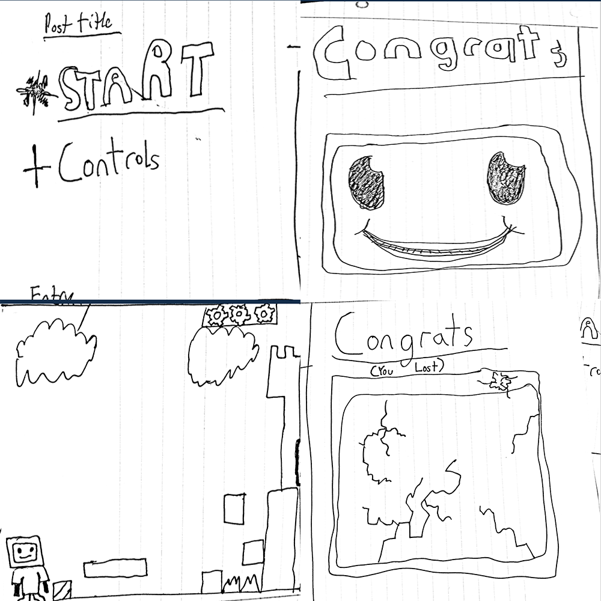
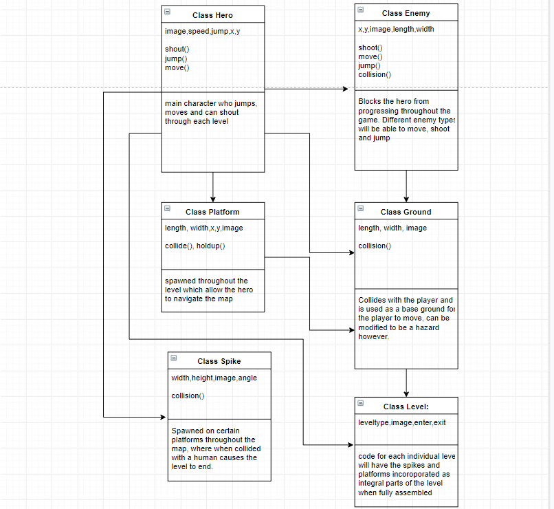

  :warning: Everything between      needs to be replaced (remove    >> after replacing)

#    Rogue Like platformer >>
## CS 110 Final Project
###    1st Semester, 1st Year >>
### [Assignment Description](https://drive.google.com/open?id=1HLIk-539N9KiAAG1224NWpFyEl4RsPVBwtBZ9KbjicE)

 [https://github.com/bucs110/final-project-fall19-feel-free-to-contribute](#)

 [https://docs.google.com/presentation/d/1dEIzJyUwzSUrwm9RalxdfODcf1GLsRS0VP4OoX60bU0/edit#slide=id.g33aee8826e_9_16](#)

### Team:    Feel Free to Contribute>>
####    Anthony Goncalves, Richard Imbro and James Klingaman >>

***

## Project Description
  A 2d platformer in which several of the sublevels within each level change every time the game is run >>

***    

## User Interface Design
* 

*    Top Left: Start screen explaining the controls and getting ready to start the level>>
*    Bottom Left: Game screen featuring the player, level and platforms as well as gears used as lives within the level >>
*    Top Right: Win screen if the player has successfully completed the levels >>
*    Bottom Right: Failure screen if the player runs out of lives>>
***        

## Program Design
* Non-Standard libraries
		None
		* Class Interface Design
    *    A simple drawing that shows the class relationships in your code (see below for an example). >>
        * 
    * This does not need to be overly detailed, but should show how your code fits into the Model/View/Controller paradigm.
* Classes
    * Hero Class: Will be used as the main playable character that will be to run and jump to finish the level
    * Levels: Generates new levels
    * Controller: Checks for the various screens of the game and is used for the purpose of controlling the character throughout the levels.
***

## Tasks and Responsibilities
* You must outline the team member roles and who was responsible for each class/method, both individual and collaborative.

### Software Lead -    Anthony Goncalves >>

   Writing the ATP and writing large portions of the classes>>

### Front End Specialist -    James Klingaman >>

   Modeled the GUI and various other interface >>

### Back End Specialist -    Richard Imbro >>

   Worked on the development of various classes and levels inside of the game>>

## Testing

* Your ATP

| Step                  | Procedure     | Expected Results  | Actual Results |
| ----------------------|:-------------:| -----------------:| -------------- |
|  1  | Open terminal, navigate to folder, and type, “python3 main.py” | Pygame window will open on the main menu screen  |          |
|  2  | click "c" on the keyboard  | window changes from the main menu screen to the control screen |                 |
|  3  | click "q" on the keyboard | window changes back to the main menu screen |                 |
|  4  | click the space bar on the keyboard | window changes to the game screen and the game starts |                 |
|  5  | Use the arrow keys to move and space bar to jump | The character on screen will be able to move and jump |                 |
|  6  | Jump on top of a platform using the spacebar and arrow keys  | Character jumps onto the platform and collides with the platform causing him to stand on it |                 |
|  7  | using the arrow keys and spacebar, navigate to the end game door and touch the character to it | window changes to  the next tile of the level where your character will spawn into |                 |
|  8  | Use the arrow keys to advance further and get to the final level | window changes to the end game screen and the player has won |                 |
|  9  | click the space bar on the keyboard | window changes to the game screen and the game ends |                 |
| 10  | Close the game, open terminal, navigate to folder, and type, “python3 main.py” | Pygame window will close then open on the main menu screen  |          |
| 11  | click the space bar on the keyboard | window changes to the game screen and the game starts again |                 |
| 12  | Use the arrow keys and space bar to navigate through different parts of the level by touching the character to the end doors in each tile | As the player progresses the tiles of the level should be different |                 |

etc...
