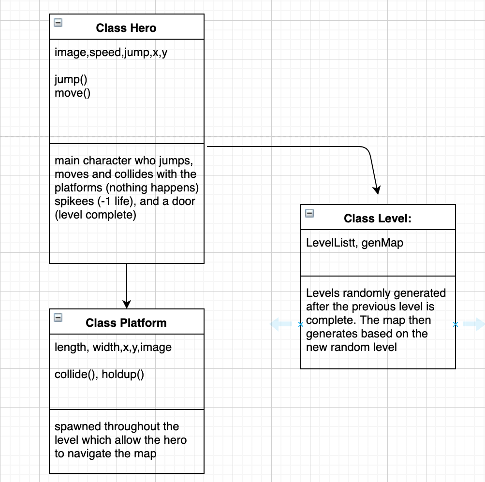

:warning: Everything between << >> needs to be replaced (remove << >> after replacing)

# << Rogue Like platformer >>
## CS 110 Final Project
### << 1st Semester, 1st Year >>
### [Assignment Description](https://drive.google.com/open?id=1HLIk-539N9KiAAG1224NWpFyEl4RsPVBwtBZ9KbjicE)

<< [https://github.com/<repo>](#) >>

<< [link to demo presentation slides](#) >>

### Team: << Feel Free to Contribute>>
#### << Anthony Goncalves, Richard Imbro and James Klingaman >>

***

## Project Description
<<A 2d platformer in which several of the sublevels within each level change every time the game is run >>

***    

## User Interface Design
* 
    * For example, if your program has a start screen, game screen, and game over screen, you should include a wireframe / screenshot / drawing of each one and a short description of the components
* << You should also have a screenshot of each screen for your final GUI >>
* << Top Left: Start screen explaining the controls and getting ready to start the level>>
* << Bottom Left: Game screen featuring the player, level and platforms as well as gears used as lives within the level >>
* << Top Right: Win screen if the player has successfully completed the levels >>
* << Bottom Right: Failure screen if the player runs out of lives>>
***        

## Program Design
* Non-Standard libraries
    * << You should have a list of any additional libraries or modules used (pygame, request) beyond non-standard python. >>
    * For each additional module you should include
        * url for the module documentation
        * a short description of the module
* Class Interface Design
    * << A simple drawing that shows the class relationships in your code (see below for an example). >>
        * 
    * This does not need to be overly detailed, but should show how your code fits into the Model/View/Controller paradigm.
* Classes
    * Hero Class: Will be used as the main playable character that will be to run, jump and shout to finish the level
    * Platform Class: Will be used as what the player will stand on to progress through each level
    * Spike Class: Will be used as an obstruction that will result in the player's death
    * Enemy Class: Will be used to block the enemy from finishing the level through causing the player to die on contact
    * Ground Class: Used as the ground of the level the player will walk on however can also be used as an obstacle such as lava floor depending on slight modification
    * Level Class: Code for each individual sub level within the code

***

## Tasks and Responsibilities
* You must outline the team member roles and who was responsible for each class/method, both individual and collaborative.

### Software Lead - << Anthony Goncalves >>

<< Worked as integration specialist by... >>

### Front End Specialist - << James Klingaman >>

<< Front-end lead conducted significant research on... >>

### Back End Specialist - << Richard Imbro >>

<< The back end specialist... >>

## Testing
* << Describe your testing strategy for your project. >>
    * << Example >>

* Your ATP

| Step                  | Procedure     | Expected Results  | Actual Results |
| ----------------------|:-------------:| -----------------:| -------------- |
|  1  | Open terminal, navigate to folder, and type, “python3 main.py” | Pygame window will open on the main menu screen  |          |
|  2  | click "c" on the keyboard  | window changes from the main menu screen to the control screen |                 |
|  3  | click "q" on the keyboard | window changes back to the main menu screen |                 |
|  4  | click the space bar on the keyboard | window changes to the game screen and the game starts |                 |
|  5  | Use the arrow keys to move and space bar to jump | The character on screen will be able to move and jump |                 |
|  6  | Jump on top of a platform using the spacebar and arrow keys  | Character jumps onto the platform and collides with the platform causing him to stand on it |                 |
|  7  | using the arrow keys and spacebar, navigate to the end game door and touch the character to it | window changes to  the next tile of the level where your character will spawn into |                 |
|  8  | Use the arrow keys to advance further and get to the final level | window changes to the end game screen and the player has won |                 |
|  9  | click the space bar on the keyboard | window changes to the game screen and the game ends |                 |
| 10  | Close the game, open terminal, navigate to folder, and type, “python3 main.py” | Pygame window will close then open on the main menu screen  |          |
| 11  | click the space bar on the keyboard | window changes to the game screen and the game starts again |                 |
| 12  | Use the arrow keys and space bar to navigate through different parts of the level by touching the character to the end doors in each tile | As the player progresses the tiles of the level should be different |                 |

etc...
